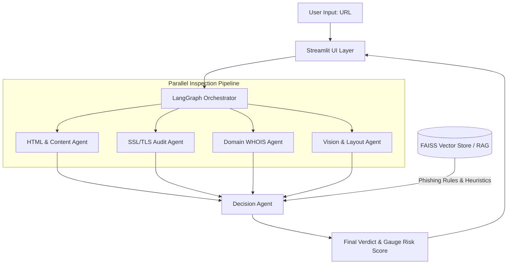
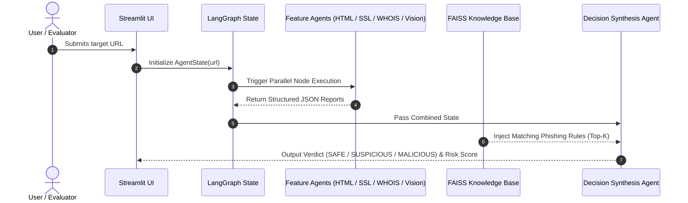

#  AI Fake Website Investigator

> An Agentic Multi-Agent AI system designed to detect phishing domains, spoofed websites, and web scams in real-time.

---

###  Student & Submission Details

* **Student Name:** Lakshani Manusha
* **Index No:** ITBIN-2313-0063
* **Live App URL:** [https://ai-fake-website-investigator-furhafrcedzo4kpy4khpvw.streamlit.app/](https://ai-fake-website-investigator-furhafrcedzo4kpy4khpvw.streamlit.app/)

[](https://ai-fake-website-investigator-furhafrcedzo4kpy4khpvw.streamlit.app/)

---

##  Project Overview & Problem Statement

Phishing attacks and fake brand impersonation sites are escalating rapidly, particularly targeting users during financial transactions and credential logins. Traditional blocklists (like Google Safe Browsing) often take hours or days to index newly registered malicious domains, creating a blind spot during zero-day phishing campaigns.

This project implements an **Agentic Multi-Agent Framework** using **LangGraph**. Instead of relying on a single monolithic LLM prompt, it delegates investigation sub-tasks to specialized AI agents working in parallel. The system inspects:

* **WHOIS & Domain Metadata:** Domain age, registrar history, and suspicious TLD patterns.
* **SSL/TLS Certificates:** Certificate validity, issuer trust, and lifespan / short-lived cert abuse.
* **Page Content & HTML Analysis:** Form action endpoints, hidden iframes, and credential harvester scripts.
* **Visual Identity (Vision AI):** Multimodal inspection of brand logo alignment, login UI mimics, and page layout anomalies.

All findings are aggregated by a central Decision Agent that cross-checks retrieved cybersecurity knowledge (via RAG) to compute a single **Risk Score (0–100)** and a clear verdict.

---

##  System Architecture

The core pipeline is built as a state graph managed by `langgraph`. Inputs are routed to feature agents, and their responses update a unified state schema before the final decision is reached.



---

## Agent-to-Agent Communication Diagram

Each feature agent operates independently and writes structured inspection reports into the shared state. The Decision Agent retrieves these JSON payloads along with relevant context vectors from FAISS.



---

##  Agent Design Patterns

The system implements four distinct agentic architectural design patterns:

**1. Router / Orchestrator Pattern**
- **File:** `graph.py` (Lines 10–22)
- **Mechanism:** The central `StateGraph` acts as a deterministic orchestrator, initializing state and scattering the payload across `network_agent`, `vision_agent`, and `decision_agent` in a clean directed graph flow.

**2. Tool-Use Pattern**
- **File:** `agents.py` (Lines 20–38)
- **Mechanism:** `network_agent` wraps raw Python tools like `python-whois` and `urllib.parse` to extract authoritative domain registration dates and registrar metadata rather than hallucinating network details.

**3. Reflection & Self-Critique Pattern**
- **File:** `agents.py` (Lines 75–125)
- **Mechanism:** The `decision_agent` receives potentially conflicting signals (e.g., a valid SSL certificate but a suspicious domain creation date) and performs a synthesis step to evaluate contradictions before assigning a final score.

**4. RAG-Augmented Reasoning Pattern**
- **File:** `agents.py` (Lines 90–110)
- **Mechanism:** Before deciding, the system queries a local FAISS vector database containing known phishing tactics, domain squatting patterns, and URL heuristics to ground LLM reasoning.

---

##  Multi-Agent System & Model Overview

| Agent Name | Core Responsibility | Primary Data Sources | Output Format |
|---|---|---|---|
| **Network Agent** | Domain age, WHOIS lookup, DNS audit | WHOIS API, DNS queries | Structured JSON |
| **Vision Agent** | Screenshot inspection & logo spoof detection | Multimodal LLM (Gemini Flash) | Visual Risk Score & Notes |
| **Decision Agent** | Aggregates all reports & checks RAG rules | Groq Llama 3.1, FAISS Vector DB | Final Score (0–100) & Verdict |

---

##  Model Choice Comparison Strategy

To handle sub-tasks efficiently without wasting tokens or increasing latency, model selection was tailored to the specific demands of each inspection stage:

| Sub-task | Model Selected | Provider | Justification |
|---|---|---|---|
| Domain & Network Audit | Code & Metadata Parsers | Python (Local) | Uses deterministic external tools (WHOIS, DNS, urllib) without spending LLM tokens. |
| HTML / Content Analysis | `llama-3.1-8b-instant` | Groq | Ultra-low latency (<400ms) with strong capability for parsing structured HTML/JSON text. |
| Visual / Screenshot Inspection | `gemini-2.0-flash-001` | OpenRouter | Native multimodal vision capabilities required to visually inspect page layouts and brand logos. |
| Decision Synthesis & RAG | `llama-3.1-8b-instant` | Groq / OpenRouter | Fast reasoning performance to synthesize four parallel agent reports against RAG security rules. |

---

##  Threat Severity Levels

| Risk Score | Verdict | Level Indicator | Recommended Action |
|---|---|---|---|
| 0 – 29 | **SAFE** | 🟢 Low | Safe to proceed and navigate normal pages. |
| 30 – 69 | **SUSPICIOUS** | 🟡 Moderate | Exercise caution. Verify credentials before logging in. |
| 70 – 100 | **MALICIOUS** | 🔴 High | Do not enter details. High likelihood of phishing. |

---

## RAG Pipeline & Evaluation

The Retrieval-Augmented Generation (RAG) module supplements the LLM with curated cybersecurity rules, common TLD risk profiles, and brand impersonation vectors.

**Vector Store Configuration**
- **Chunking Method:** `RecursiveCharacterTextSplitter` (chunk_size=500, chunk_overlap=50)
- **Embedding Model:** `sentence-transformers/all-MiniLM-L6-v2` (Runs locally in CPU memory)
- **Vector Database:** FAISS (`faiss-cpu`)

---

##  Local Installation & Setup

### Prerequisites
- Python 3.10, 3.11, or 3.12 installed
- Git installed

### Setup Steps

```bash
# 1. Clone the repository
git clone https://github.com/Laka-Manu/ai-fake-website-investigator.git
cd ai-fake-website-investigator

# 2. Create and activate a virtual environment
python -m venv venv

# On Linux/macOS:
source venv/bin/activate
# On Windows (Git Bash or CMD):
venv\Scripts\activate

# 3. Install required packages
pip install -r requirements.txt

# 4. Set up environment variables
export GROQ_API_KEY="gsk_your_groq_api_key"
export OPENROUTER_API_KEY="sk-or-your_openrouter_api_key"

# 5. Launch the Streamlit App
streamlit run app.py
```

---

##  Known Limitations

- **Anti-Bot & Cloudflare Protection:** Websites behind strict WAFs (like Cloudflare Bot Management or Imperva) may block headless WHOIS lookups or screenshot scrapers, returning HTTP 403 status codes.
- **Zero-Day Evasion Tactics:** Phishing sites using cloaking techniques (serving different content to automated scanners vs. real users) can temporarily bypass static page inspection.
- **Free Tier API Token Limits:** When running heavy multi-agent queries via OpenRouter's free tier, token usage must be capped (`max_tokens <= 1000`) to avoid API rate limits (HTTP 402).